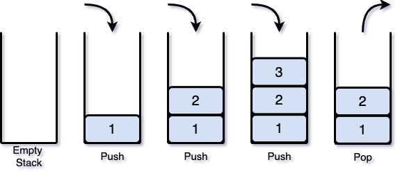
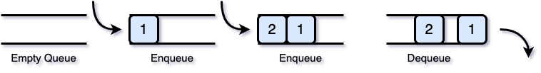

### 스택(Stack)

스택은 후입선출([**LIFO**](https://ko.wikipedia.org/wiki/후입_선출), Last In First Out) 특성을 갖는 자료구조이다. 스택은 구조상 맨 위(top)에서 데이터의 모든 삽입(push)과 삭제(pop)가 일어난다. 즉 마지막에 들어간 항목이 가장 먼저 나오는 자료구조이다.

</img> 

스택에 대한 연산에는 다음과 같은 것들이 있다.
* Stack(n) : n만큼의 크기를 갖는 스택을 생성
* Push(x) : x라는 원소를 스택의 맨 위(top)에 삽입
* Pop() : 스택의 맨 위(top)에 원소를 삭제하고 반환
* Peek() : 스택의 맨 위(top)에서 원소를 삭제하지 않고 반환
---
### 큐(Queue)

큐는 선입선출([**FIFO**](https://ko.wikipedia.org/wiki/선입_선출), First In First Out) 특성을 갖는 자료구조이며, 대기열이라고도 칭한다. 큐는 한쪽 끝에서 삽입이 일어나고 그 반대쪽 끝에서 삭제가 일어난다. 데이터가 들어오는 위치는 가장 뒤(rear)에 있고 데이터가 나가는 위치는 가장 앞(front)에 있어서, 먼저 들어온 데이터가 먼저 나가게 된다.

</img> 

큐에 대한 연산에는 다음과 같은 것들이 있다.
* Queue(n) : n만큼의 크기를 갖는 큐를 생성
* Enqueue(x) : x라는 원소를 큐의 뒤(rear)에 삽입
* Dequeue() : 큐의 앞(front) 부분에서 원소를 삭제하고 반환
* Peek() : 큐의 앞(front) 부분에서 원소를 삭제하지 않고 반환
